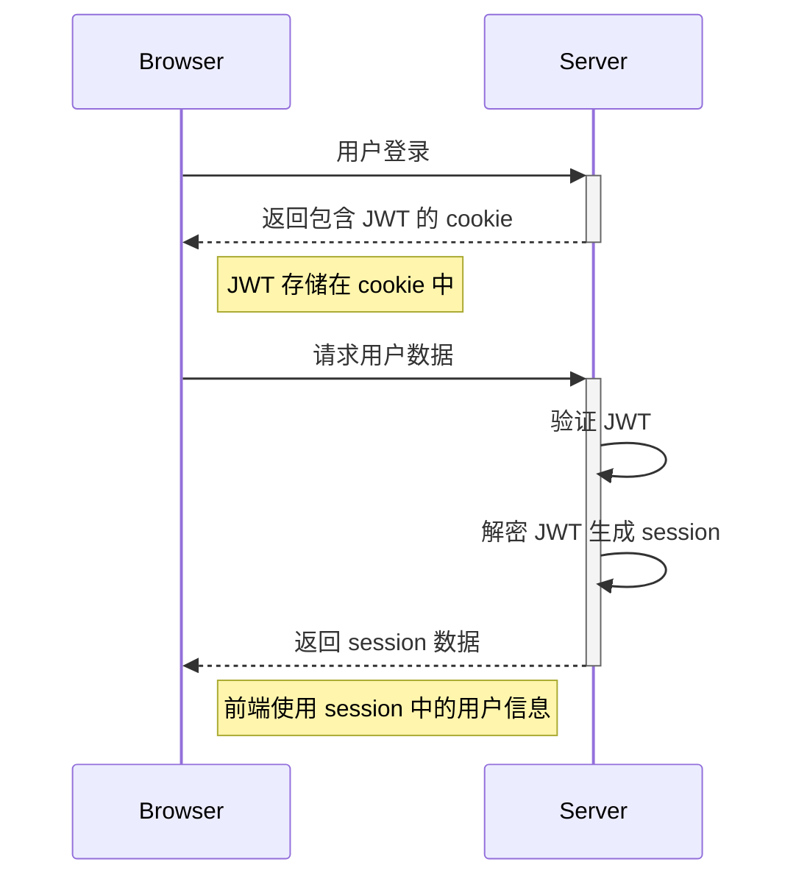

# next-auth 备忘

## 流程

```mermaid
sequenceDiagram
  Browser->>+Server: 用户登录
  Server-->>-Browser: 返回包含 JWT 的 cookie
  Note right of Browser: JWT 存储在 cookie 中
  Browser->>+Server: 请求用户数据
  Server->>Server: 验证 JWT
  Server->>Server: 解密 JWT 生成 session
  Server-->>-Browser: 返回 session 数据
  Note right of Browser: 前端使用 session 中的用户信息
```
